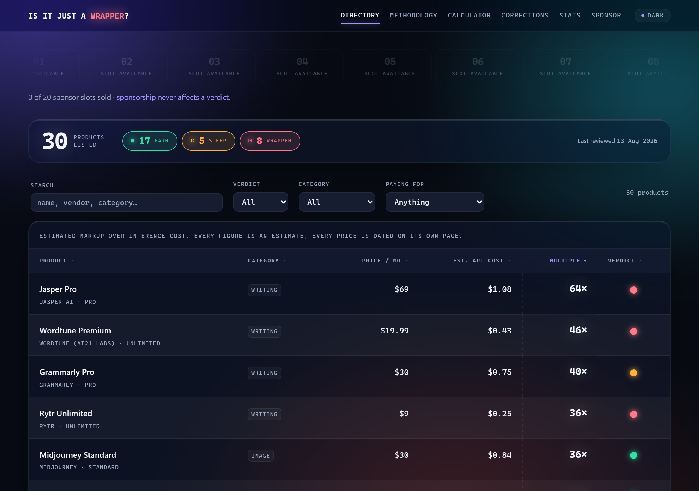

# Is it just a wrapper?

**How much of an AI product's price is the model, and how much is everything else?**

**[isitjustawrapper.com](https://isitjustawrapper.com)**



A public directory that estimates, for each AI product, the gap between what it charges and what the same month of
inference would cost at published API rates. Every entry states its usage assumption, shows the arithmetic, links its
sources and carries a date.

## Verdicts

| | |
| :-- | :-- |
| 🟢 **Fair** | The price mostly buys things that aren't the model: evals, data, integrations, compliance, real product work |
| 🟡 **Steep** | Genuine work on top of the API, but a motivated user has cheaper paths |
| 🔴 **Wrapper** | An interface and a system prompt over a public API |

"Wrapper" describes an **architecture, not conduct**. Building one is legal and common. Nothing here is an allegation
of wrongdoing.

**The multiple never decides the verdict on its own.** Midjourney and Rytr sit at the same ~36× and get opposite
verdicts — one trains its own model, the other is a menu over someone else's. Cursor is priced *below* its estimated
token bill. [The methodology](https://isitjustawrapper.com/methodology) explains how each verdict is reached.

## How the numbers stay honest

- **Human-verified.** Every price was checked by a named person on a stated date. The build refuses to deploy an
  unverified entry.
- **Watched weekly.** A job re-fetches every pricing page and rate card; if a recorded price disappears, the entry is
  pulled back to unverified automatically.
- **Floors, not ceilings.** Real vendor costs are usually below these estimates, so every multiple is conservative.
  Prices are always month-to-month.
- **Corrections are public.** Every change to a published figure is logged at
  [/corrections](https://isitjustawrapper.com/corrections).

## Found something wrong?

- **A price or fact** — [open a correction](../../issues/new?template=correction.yml)
- **A verdict** — [dispute it](../../issues/new?template=verdict-dispute.yml)
- **A missing product** — [suggest it](../../issues/new?template=new-entry.yml)
- **Privately** — <office@isitjustawrapper.com>

See [CONTRIBUTING.md](CONTRIBUTING.md) for the schema and verdict criteria.

## Development

Astro, static output, no client-side framework. Requires Node 22.12+.

```bash
npm install
npm run dev
```

| Command | What it does |
| --- | --- |
| `npm run admin` | What needs attention: unverified, flagged or stale entries |
| `npm run admin:verify` | Walk unverified entries and record your confirmation |
| `npm run admin:new` | Add a product |
| `npm run check:publish` | The deploy gate — fails while any entry is unverified |
| `npm run watch:prices` | Re-check every pricing page for changes |

Entries in `data/apps/` store usage, never cost; costs and multiples are computed at build time from
`data/rates.json`, so one rate change updates every figure. Hosting and maintenance:
[docs/OPERATIONS.md](docs/OPERATIONS.md).

## Licence

Code [MIT](LICENSE). Data CC BY 4.0 — use it, cite the source. The full dataset is at
[isitjustawrapper.com/data.json](https://isitjustawrapper.com/data.json).
